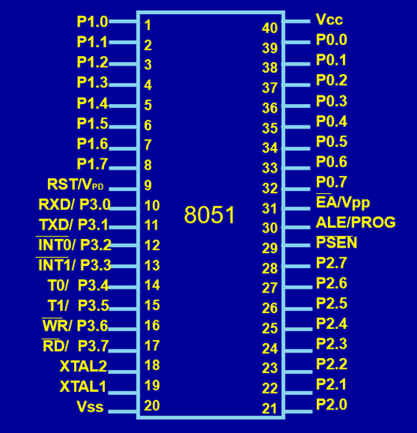
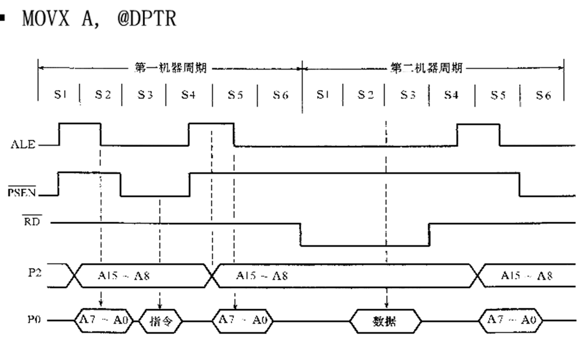
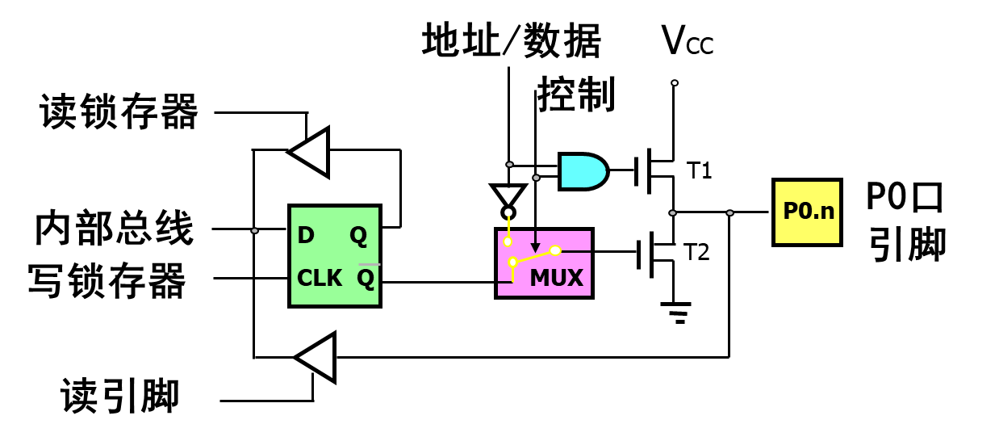
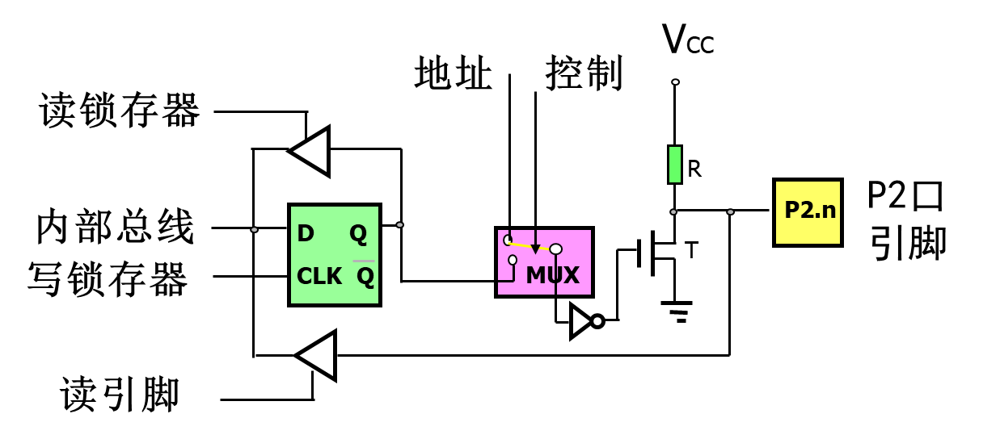
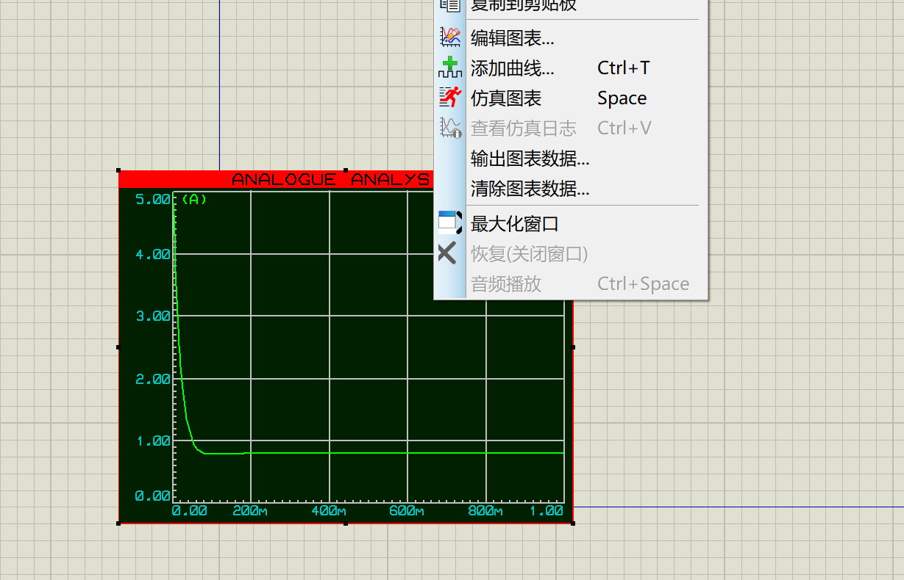

# BME3308 嵌入式计算机系统与实验 AT89C51部分

## 课程笔记

### 概述

嵌入式的外设分为片内外设与片外外设, 一般来说的"外设"通常指片内外设
**程序通常是写在ROM的数据存储器的**，其设计上不能直接修改，需要进行烧录（EPROM/Flash等），即RAM通常存数据，ROM通常存代码
CPU的位宽：

- 数据总线的宽度与寄存器的长度
- MCS51为8位机，MSP430为16位机，PC是32/64位
  数据总线与地址总线：
- 数据总线的宽度与地址总线的宽度分别控制单个操作数的长短与可寻址的范围，二者不一定完全等同
- 例如，若数据总线为8位，地址总线位16位，则其可访问ROM内（0x0000\~0xFFFF）之间的操作数，每个操作数范围为0x00\~0xFF

哈佛与冯诺伊曼架构：

- 前者的数据与指令存储是分开的, 后者是存储在同一存储器中的, 51(算)是前者, 430和大部分PC是后者

51单片机没有操作系统, 直接在裸机上运行

寄存器：

- MCS-51的寄存器为R0~R7，以及一些非通用寄存器如指令存储器，程序寄存器等

分时操作系统与实时操作系统(单核系统):

- 分时操作系统会实现分配比较固定的资源给不同任务，可能不会在执行过程中进行调节与调动
- 实时操作系统则会更严格地控制执行时间与顺序，实现时间最大化

简单排榜：SOC>MPU（微处理器）>MCU（微控制器）, EDSP论外,
单片机为MPU, 洗衣机等家电大多是是微控制器或者EDSP驱动; 当然，四者其实也没有非常明确的区分

### 单片机架构概述

#### 51单片机的接口


头上有杠的表示是在低电平下位生效状态
共四十个, 输出接口共4\*8=32个, 其余为特殊接口
输出接口中P3有复用功能, P0在外接存储的时候可做地址线的低八位和数据总线, P2在外接存储时可做地址线的高八位

- 主电源引脚: vss接地, vcc正常操作时为电源
- 晶振电路: XTAL1, XTAL2
- PROG/ALE: 共用接口:
  - 为PROG时, 其在EPROM型单片机中用于接收编程脉冲;
  - 为ALE时, 其可以所存地址的低八位, 或者作为对外输出脉冲的时钟信号(振荡器的1/6 但在访问外部存储时会跳过一次脉冲)
- PSEN: 片选引脚, 有效(低电平)时提示所连接的外部存储其即将被访问
- 特殊I/O接口: P3系列
  | 端口名/基础功能 | 第二功能 |
  | --- | --- |
  |P3.0| RXD 串行输入(数据接收)口 |
  |P3.1| TXD 串行输出(数据发送)口 |
  |P3.2| INT0(带杠) 外部中断0输入线(低电平有效) |
  |P3.3| INT1(带杠) 外部中断1输入线(低电平有效) |
  |P3.4| T0 定时器0外部输入 |
  |P3.5| T1 定时器1外部输入 |
  |P3.6| WR(带杠) 外部数据存储器写选通信号输出(低电平有效) |
  |P3.7| RD(带杠) 外部数据存储器读选通信号输入(低电平有效)


`MOVX A, @DPTR` 的含义是访问寄存器"数据指针"对应地址里的数据, 此处PSEN接口连接的是程序储存器: 流程大致如下:

1. (S1~S2)首先P2口发出高八位信号, P0口发出低八位信号, 当ALE生效时, P0的低八位信号被锁存, 锁存器保存的P0, P2共16位信号拼接成目标地址, PSEN有效, 说明是读取的**程序**存储
2. (S3~S4)找到目标地址(此处为MOVX指令), 并通过数据总线发送回P0口
3. CPU接受操作数并译码成指令, 并类似1的方式将DPTR的地址发送给**数据**存储
4. 将目标地址的数据通过数据总线发送回P0口

#### 单片机的存储

大部分电脑采用的是统一编址的结构, 例如, `0x0000` 地址对应的就是存储器中的唯一地址中的一个字节, 而51单片机并没有采用统一编址的形式, 其一个逻辑地址可能对应4个存储单元的不同地址(片内/片外 ROM/RAM):

- 访问程序存储器: `MOVC`, 具体是片内还是片外由EA引脚决定(高内优先低外) **注意这个EA和控制中断的EA字节是两个东西!**
- 片内数据存储器: `MOV`
- 片外数据存储器: `MOVX`

所有外部数据存储器中的数据一般需要先在A寄存器中中转一下才可以用

#### 单片机的寄存器

除开R0~R4这四个通用寄存器以外, 还有大量的具有特殊功能的寄存器, 如下:

1. A(ACC), B, PSW 与ALU相关的寄存器, A, B通常做四则运算存储操作数所用, PSW则反应了当前指令的执行状态
2. SP, SPTR 堆栈指针与数据指针, 后者为2个8位组合的16位的寄存器
3. 端口有关的: P0~P3同样是特殊寄存器, SCON, SBUF, PCON
4. 定时/计数: TMOD, TCON, TH0, TL0, TH1, TL1, 分别为T0, T1的记数初值寄存器
5. 中断: IE(位于A8H, 位寻址AFH~A8H, EA就是其中之一), IP
6. 程序计数器PC, 同样是一个组合而成的16位寄存器
   
   复位后寄存器的地址与初始值

### I/O 结构与工作原理

在无片外存储器的系统中, 4个端口的每一个端口每一位都可以作为准双向口来使用(P0做地址数据线的时候才是真正的双向口)
准双向口: 读端口引脚状态前，需要先写一个1进去，否则读到引脚状态不确定
MUX打上时为总线模式, 打下时为I/O模式  

P0口的结构(其他I/O口也整体差不多)

#### D触发器:

CLK为高时Q, D同步, CLK为低电平时Q保持不变(自身前一时刻相同)

#### P0口:

1. 其作为普通I/O口时:

- 输出需要使用外接上拉电阻, 分为高低电平
- 输入又分读锁存器与读引脚

2. 其作为总线的一部分:

- 程序存储器: 仅输出地址不输出数据
- 数据存储器: 既输出地址也输出数据
  
  如上左图为连接程序存储器, 右图为连接数据存储器

##### P0口的输出

输出时控制开关打下, T1时钟处在关闭状态, 当内部总线输出信号0时, Q负为1, T2导通, 引脚接地输出1信号; 当内部总线输出信号为1时, Q负为0, T1, T2都不导通, 接口本身的输出信号实际不明, 所以这个时候我们需要所谓的上拉电阻.
(我的理解是, P0的实际输出为低电平和"不是低电平", 其本身并不能输出高电平, 上拉电阻本身其实类似于一个外部电源, 在P0口输出"不是低电平"时给外部一个高电平信号)

##### P0口的输入

1. 读引脚(`MOV`等指令): 现发送一个高电平, 确保T2关断之后, 内部总线直接从下路读取引脚电平
2. 读锁存器(`ANL`(读-改-写)等指令)
   只有当目的操作数为IO口时，读的才是锁存器的状态。比如 ORL P1，A； 读的是锁存器状态
   如果操作中IO是源操作数，则读的还是引脚的状态。 ，比如ORL A，P1；MOV A，P0等， 则读的是引脚的状态。

##### P0口做总线

- 输出:
  看上图其实比较明显了, 总线模式下控制信号为1, 输出1时, 上路与门导通, T1打开, 输出引脚与VCC连通输出高电平; 输出0时, 上路断开, 下路T2导通, 输出引脚接地为低电平
- 输入:
  直接走下路即可

#### 其他I/O口

- P1: 最简单的一个接口, 不需要上拉电阻
  
- P2: 在结构上注意这里是Q端连线而不是Q负端连线, 在实际效果上其与P0相比不需要上拉电阻
  
- P3: 当作为普通I/O口时, W恒为1, 实际输出信号由D口决定, 当作为第二输出功能(端口复用)时, D时钟为1, 实际输出信号由W口决定, 读取时Q, W都为1, 信号走下路
  

#### 访问外部存储器的总线与时序

振荡周期(又名时钟周期, 即晶体震荡一次的时间)-状态周期(包含两次震荡周期)-机器周期(一个机器周期包含12个时钟周期)-指令周期(执行一次指令的周期, 以机器周期为单位, 不低于一个机器周期)
一些例子 `INC` `ADD` 单周期指令, `INC` 双周期, `MOV` `DIV` 四周期(所以字节数与周期数之间也没有任何关系)

### 单片机的汇编指令

Rn可以泛指R0~R7之一, 而Ri一般都是指R0或R1

#### 指令的寻址方式

- 立即寻址: 即直接把立即数赋给目的操作数
- 直接寻址: 通过直接使用地址的方式找操作数, 如`MOV A, 30H`
- 寄存器寻址: 把一个寄存器内的操作数赋值给另一个寄存器内的操作数
- 寄存器间接寻址: 类似于在一个寄存器内存指针, 如`MOV A, @R0`, 也就是把R0中的数据的地址里的黍赋给A
- 变址寻址: 我觉得这种寻址方式需要注意的就是指令前A存的是一个地址的偏移量, 而指令后A存的是一个正常的数值了
- 相对寻址: 将PC值与另一个值相加, 同样是在改变地址, 常用于`JC`指令
- 位寻址: 51单片机的数据存储器中有位地址区, 我们可以通过作用于单位的指令(例如`SETB`)来操作这些地址

#### 数据传输类指令

- `MOV OP1, OP2`: 其操作数支持你能想到的所有类型的组合方式(立即数/寄存器/直接地址/间接地址...), 其甚至可以进行16位数据的传输(例如`MOV DPTR, #1234H`)
- `MOVX`: 与外部数据存储器(RAM)交互无论是将数据送出还是接受都必须要用A, 换言之必须有一个操作数为A
- `MOVC`: 与外部程序存储器(ROM)交互, 主要用于查表操作中(`MOVC A, @A+DPTR`, `MOVC A, @A+PC`)
- `PUSH`, `POP`: 入栈出栈, 同样支持大部分操作数类型
- `XCH OP1, OP2`: 交换两操作数的数
- `XCHD OP1, OP2`: 仅交换低4位
- `SWAP OP`: 操作数高低位互换

#### 算术运算类指令

- `ADD`: 加, 不考虑`PSW`中的`CY`位, `ADDC`, 考虑`CY`位
- `INC`: ++
- `DA A`: 将A中的数转换为10进制表示(其对计算机仍然会被作为16进制参与后续运算)
- `SUBB`: 考虑`CY`位的减法
- `MUL`: A, B相乘, 高8位进B, 低八位进A
- `DIV`: A除以B, 商进A余数进B

#### 逻辑运算类指令

- `ORL`: OR Logical instruction, 或运算, 输出到第一个操作数, 若直接地址为端口则先读取再输出
- `ANL`: ANd Logical instruction, 与运算, 类似`ORL`
- `XRL`: eXclusive oR Logical instruction, 异或运算
- `RR`, `RL`: 循环移位, R即右移, L即左移, `RRC`, `RLC` 即加上CY位一起移动

#### 控制转移类指令

- 无条件转移:
  不同类型的指令长度不同
  - `AJMP addr11`: 转移范围2kb
  - `LJMP addr16`: 转移范围64kb
  - `SJMP rel`: 跳转范围-128~+127
  - `JMP @A+DPTR`间接转移
- 条件转移:
  - `JZ`, `JNZ`: Jump if Zero, Jump if Not Zero, 操作数可以为相对地址偏差或标号
  - `CJNE OP1, OP2`: Compare Jump if Not Equal 最后跳转目标同样可以为地址偏差或标号
  - `DJNZ`: Decrement Jump if Not Zero --然后和0比较
- 调用与返回:
  - `LCALL`, `ACALL` 区别与联系类似`LJMP`与`AJMP`
  - `RET`, `RETI`, return与中断定制的return, 不能混用
- `NOP` 什么也不干

#### 位操作指令

- `CLR`, `SETB`: 位置0与位置1
- `ANL`, `ORL`: 位与, 位或
- `JC`, `JNC`: 如果cy=/!=1转移
- `JB bit, rel/label`, `JNB bit rel/label`: 如果bit=/!=1转移
- `JBC`: bit=1转移, 同时`CLR`此位

### 单片机的程序设计

C语言, 汇编语言分别由编译器与汇编器生成目标程序, 然后会被连接器连接成二进制机器码`.BIN`, 最后会被转换为`.HEX`文件烧录进去(`.BIN`和`.HEX`都只有一个文件)

#### 单片机的伪指令

- `ORG` 定义接下来一段程序的起始位置
- `END` 整段汇编程序结束的伪指令
- `EQU` 类似`#define`, `AA EQU 40H`
- `DB` 从指定单元开始连续定义对应地址上的值, `DB 34H`
- `DW` 类似`DB`但一次是两个地址 `DB 1234H`
- `BIT` 把位地址赋于规定的字符名称 `ABC BIT P1.1`

#### C/ASM混合程序设计

##### 函数传参规则

在 KEIL C51 中，编译器会对 C 语言程序中的函数进行自动转换，转换规则如下：

| 函数属性                       | 函数举例                     | 段中的函数名 |
| ------------------------------ | ---------------------------- | ------------ |
| 无参数或无寄存器参数传递的函数 | `func1(void)`                | `func1`      |
| 含通过寄存器参数传递的函数     | `void func2(int)`            | `_func2`     |
| 可重入函数                     | `void func3(char) reentrant` | `_?func3`    |

这里"段中的函数名"是指编译后的汇编代码, 可重入函数是指可以被中断并在中断服务程序中安全调用的函数。编译器会采取一些措施来保证其可重入性，例如在栈上保存局部变量。

| 参数类型    | 第 1 个参数 | 第 2 个参数 | 第 3 个参数 |
| ----------- | ----------- | ----------- | ----------- |
| char/int8   | R7          | R5          | R3          |
| int16       | R6、R7      | R4、R5      | R2、R3      |
| long, float | R4-R7       | R4-R7       | 无          |
| 一般指针    | R1、R2、R3  | R1、R2、R3  | R1、R2、R3  |

| 返回值类型      | 寄存器     | 说明                                 |
| --------------- | ---------- | ------------------------------------ |
| bit             | C          | 进位标志 CY                          |
| (unsigned) char | R7         |                                      |
| (unsigned) int  | R6、R7     | 高位在 R6，低位在 R7                 |
| (unsigned) long | R4-R7      | 高位在 R4，低位在 R7                 |
| float           | R4-R7      | 32 位 IEEE 格式，指数和符号位在 R7   |
| 指针            | R1、R2、R3 | R3放存储器类型，高位在 R2，低位在 R1 |

##### C/ASM混合编程实例

```C
// main.c
#include <reg51.h>
extern int sqr(int a, int b);
int main() {
  int a = 3;
  int b = 4;
  int c = 0;
  c = sqr(a, b);
  return 0;
}
```

```
; functions.a51
?PR?FUNCTION SEGMENT CODE ;在程序存储器中定义段, FUNCTION为段名可自定义

RSEG ?PR?FUNCTION ;表示函数可被连接器放置在任何位置, RSEG为段名属性

public _sqr ;声明函数可被其他模块调用, 函数名与C里的函数名遵循上面提到的转换规则

_sqr:
    MOV A, R7
    MOV B, R7
    MUL AB
    MOV R7, A
    MOV R6, B
    MOV A, R5
    MOV B, R5
    MUL AB
    MOV R5, A
    MOV R4, B
    MOV A, R7
    ADD A, R5
    MOV R7, A
    MOV A, R6
    ADDC A, R4
    MOV R6, A
    RET

END
```

### 单片机的中断系统

程序正常运行->中断信号输入->正常运行停止, 跳转到中断向量表(即0003H等处)->由中断向量表处程序再重定向至实际的中断程序部分->执行中断程序->执行完成, 返回继续执行原程序

#### MCS51单片机中断系统


- 中断源: 8051有5个, 分为两个优先级, 不同优先级之间的可以形成相互嵌套, 分别是:
  - P3.2, P3.3, 外部中断, 实际意义上"可控"的中断源
  - TF0, TF1, 片内的定时器0, 1的中断
  - R0, T1, 串行口中断请求标志
- 中断标志位: 在A8H地址处有一个8位的寄存器中断允许寄存器IE, 其控制了单片机是否能中断
  - 第七位 EA: 控制所有中断是否被允许的位, 只有打开了这个才可以接受中断
  - 0~4位: 分别控制外部中断0, 定时器/计数器T0中断允许, 外部中断1, T1中断允许和串行口中断允许
- 中断的触发方式: 在88H(位寻址8FhH~88H)处有个定时器控制寄存器, 其控制了具体的触发方式, 其第0和第二位控制了外部中断请求的触发方式, 若为1则为脉冲/下降沿方式(高变低时触发), 置零时为电平方式(低电平时触发), (类似一个看导数, 一个看本身)
  - 建议采用低电平时, 低电平只保持一个机器周期避免重复出发, 使用下降沿时, 确保下降前的高电平和下降后的低电平都能保持至少一个机器周期确保能正常触发
- 中断的优先级控制:

  - 8051 单片机拥有两级中断优先级，支持二级中断服务嵌套。每个中断源的优先级由中断优先级寄存器 IP 中的相应位决定。IP 寄存器的字节地址为 B8H，各位（从高到低）依次为 PT2、PS、PT1、PX1、PT0、PX0。其中，PX0 (IP.0) 是外部中断 0 优先级设定位，PT0 (IP.1) 是定时/计数器 T0 优先级设定位，PX1 (IP.2) 是外部中断 1 优先级设定位，PT1 (IP.3) 是定时/计数器 T1 优先级设定位，PS (IP.4) 是串行口优先级设定位，PT2 (IP.5) 是定时/计数器 T2 优先级设定位。

  - 当同一优先级中有多个中断请求时，会存在中断优先权排队问题。同级中断的优先权由中断系统硬件确定的自然优先级形成，其排列顺序如下：外部中断 0 (INT0) > 定时/计数器 0 (T0) > 外部中断 1 (INT1) > 定时/计数器 1 (T1) > 串行口。需要注意的是，这种排队只在响应之前有效，一旦某个同级中断被响应，其他同级中断不能打断其服务。下表总结了各中断源的响应优先级及中断服务程序入口地址：

    | 中断源             | 中断标志 | 中断服务程序入口 | 优先级顺序 |
    | ------------------ | -------- | ---------------- | ---------- |
    | 外部中断 0 (INT0)  | IE0      | 0003H            | 高         |
    | 定时/计数器 0 (T0) | TF0      | 000BH            |            |
    | 外部中断 1 (INT1)  | IE1      | 0013H            |            |
    | 定时/计数器 1 (T1) | TF1      | 001BH            |            |
    | 串行口             | RI 或 TI | 0023H            | 低         |

  - 8051 单片机的中断优先级遵循以下三条原则：

    - 当 CPU 同时接收到多个中断请求时，首先响应优先级最高的中断请求。
    - 正在进行的中断过程不能被新的同级或低优先级的中断请求所中断。
    - 正在进行的低优先级中断服务，能被高优先级中断请求所中断。

    为了实现后两条原则，中断系统内部设置了两个用户不可寻址的优先级状态触发器。一个置 1 表示正在响应高优先级中断，此时会阻止所有后续的中断请求；另一个置 1 表示正在响应低优先级中断，此时会阻止所有后续的低优先级中断请求。

#### MCS51的中断过程

中断必须同时满足中断源有中断请求, CPU总中断打开(EA=1), 对应的中断允许位为1才可以正常触发, 其理论最快响应时间需要3个机器周期(1周期查询, 2周期调用LCALL跳转倒中断服务程序)

##### 中断响应过程

中断服务的进入过程如下：

1.  在 CPU 执行程序的每个机器周期的 S5P2 期间，中断系统对各个中断源进行采样。这些采样值在下一个机器周期内按优先级和内部顺序被依次查询。
2.  如果在上一个机器周期的 S5P2 时某个中断标志被置为 1，那么它将在当前的查询周期中被及时发现。
3.  相应的优先级状态触发器被置 1，以阻止后续的同级或低级中断请求。
4.  执行一条硬件 LCALL 指令，将程序计数器 PC 的内容压入堆栈保存，并将相应的中断服务程序的入口地址送入 PC。
5.  执行中断服务程序。
    需要注意的是，中断响应过程的前两步由中断系统内部自动完成，而中断服务程序则需要用户编写。
    在以下任一条件下，硬件将受阻，不会产生 LCALL 指令：

- CPU 正在处理同级或更高优先级的中断。
- 当前查询的机器周期不是所执行指令的最后一个机器周期，即在完成当前指令前不会响应中断，以保证指令执行的完整性。
- 正在执行的指令为 RET、RETI 或任何访问 IE 或 IP 寄存器的指令。只有在这些指令后面至少再执行一条指令时才能接受中断请求。

##### 中断返回

中断返回通过执行 RETI 指令来实现，其具体功能是：

1.  将中断响应时压入堆栈保存的断点地址从栈顶弹出并送回 PC，使 CPU 从中断发生的地方继续执行程序。
2.  将相应的中断优先级状态触发器清 0，通知中断系统当前中断服务程序已执行完毕。
    **注意：** 在中断服务程序中，不能使用 RET 指令代替 RETI 指令。此外，PUSH 指令与 POP 指令必须成对使用，否则可能导致断点返回错误。

### 单片机的定时/计数器

#### 定时器与计数器的结构与组成

无论是定时器还是计数器其本质都是+1计数器, 在8051中总共有两个定时器, 在实际组成上体现为一个TMOD, 定时/计数器工作方式寄存器, 用来确定定时/计数器的工作模式, 和一个TCON, 定时/计数器控制寄存器, 用来确定其是否启用, 以及能否触发中断

> 设置为计数器模式时，外部事件计数脉冲由T0或T1引脚输入到计数器。在每个机器周期的S5P2期间采样T0、T1引脚电平。当某周期采样到一高电平输入，而下一周期又采样到一低电平时，则计数器加1，更新的计数值在下一个机器周期的S3P1期间装入计数器。由于检测一个从1到0的下降沿需要2个机器周期，因此要求被采样的电平至少要维持一个机器周期。当晶振频率为12MHz时，最高计数频率不超过1/2MHz，即计数脉冲的周期要大于2 us。

##### TMOD (Working Mode Register)

工作方式寄存器 TMOD 用于设置定时/计数器的工作方式，低四位用于 T0，高四位用于 T1。其格式如下

| 位 (Bit)      | 7    | 6   | 5   | 4   | 3    | 2   | 1   | 0   |      |
| ------------- | ---- | --- | --- | --- | ---- | --- | --- | --- | ---- |
| 字节地址: 89H | GATE | C/T̅ | M1  | M0  | GATE | C/T̅ | M1  | M0  | TMOD |

- GATE = 0 时，只要用软件使 TCON 中的 TR0 或 TR1 为 1，就可以启动定时/计数器工作；
- GATE = 1 时，要用软件使 TR0 或 TR1 为 1，同时外部中断引脚 INT0 或 INT1 也为高电平时，才能启动定时/计数器工作。INT0 控制 T0，INT1 控制 T1.
- C/T̅ 确实是定时器(=0)还是计数器(=1)
- M1/M0共同控制其工作模式(细节见后)

##### TCON (Control Register)

TCON 的低 4 位用于控制外部中断，TCON 的高 4 位用于控制定时/计数器的启动和中断申请。其格式如下：

| 位 (Bit)      | 7   | 6   | 5   | 4   | 3   | 2   | 1   | 0   |
| ------------- | --- | --- | --- | --- | --- | --- | --- | --- | ---- |
| 字节地址: 88H | TF1 | TR1 | TF0 | TR0 |     |     |     |     | TCON |

- TF1 (TCON.7): T1 溢出中断请求标志位。T1 计数溢出时由硬件自动置 TF1 为 1。CPU 响应中断后 TF1 由硬件自动清 0。T1 工作时，CPU 可随时查询 TF1 的状态。所以，TF1 可用作查询测试的标志。TF1 也可以用软件置 1 或清 0，同硬件置 1 或清 0 的效果一样。

- TR1 (TCON.6): T1 运行控制位。TR1 置 1 时，T1 开始工作；TR1 置 0 时，T1 停止工作。TR1 由软件置 1 或清 0。所以，用软件可控制定时/计数器的启动与停止。

- TF0 (TCON.5): T0 溢出中断请求标志位，其功能与 TF1 类同。

- TR0 (TCON.4): T0 运行控制位，其功能与 TR1 类同。

- 此外还有四个定时/计数器 8AH(T0低8位), 8BH(T1低8位), 8CH(T0高8位), 8DH(T1高8位)

#### 定时/计数器的模式

由M1M0共同决定, 换言之有4种模式

##### 模式0, 1

最常见的计数方式, 需要注意的点:

- 达到计数上限时溢出并尝试发起中断, 随后复位为0(即使用此模式作为定时/计数器时, 实际定时时间是由你选定的初值决定了, 同时每次重置的时候需要手动设)
- 然后模式0和1唯一的区别是一个是13位(低8位的最高三位不用), 一个是16位

##### 模式2

8位, 但是可以自动重装填

##### 模式3

仅适用于T0, 简单来说其效果就是把T0拆分成两个独立的8位计数/定时, 当然, 机制决定其多出来的哪一个定时器会把T1的部分功能顶掉, 例如运行控制和中断请求等功能, 这个时候T1通常使用方式2作为串口波特率发生器，或者方式0，1，2但不需要中断的场合。

### 单片机的串口通信

#### 串行通信原理

并行通信指产生的数据同时发送, 好处是控制简单传输速度快, 但问题是需要较宽的传输带宽. 串行通信则是将数据拆分成一个更小的单位逐个发送

串行通信的传输方向:

- 单工: 指只有一个方向
- 半双工: 指可以双向但不能同时进行
- 双工: 指可以同时双向

同步通信与异步通信: 同步通信需要两台机器的时钟信号完全相同(即频率一样, 相位也要一样), 异步通信只要求频率(尽可能)一致

## 课余备忘

- 如果下载keil创建项目时找不到Legacy Database..., 下拉菜单键为灰色, [请额外下载旧版包](https://developer.arm.com/documentation/101407/0541/Creating-Applications/Tips-and-Tricks/Use-MDK-Version-4-Projects)

- 汇编指令:
  注意哪些是八位指令, 哪些是一位指令

  - `ORG` 称为伪指令, 其不会被翻译为机器码, 只用于指明后续指令位于何处
  - `MOV A,B` 将B的值复制给A，可以为立即数，端口，寄存器等
  - `CLR P1.0` 即clear，将指定位/寄存器置零
  - `JB P, TAG` 即Jump if Bit set, 若P位为1则跳转至TAG
  - `DJNZ A, TAG` 即Decrement and Jump if Not Zero, 即将A的值--, 若--后非零则跳转至TAG
  - `SETB P` 将P电位设为1

- 振荡周期就是时钟信号的周期, 其由振荡器的晶振或者其他时钟源提供; 机器周期是单片机执行一条指令所需的时间, 对a51单片机来说通常是振荡周期的12倍
- 最小系统：对51单片机包含 1.电源和地 2.时钟电路 3.复位电路 4.外部memory，似乎在实际的Proteus仿真过程中电源电路是自带且自动隐藏的，而外部memory也非必须，重点还是在复位电路和时钟电路上
- 复位电路

  - 用REALCAP，不用CAP
  - 上电复位电路用示波器看不出来的话就用最左侧工具栏图形模式>analogue, 然后画一个图, 右侧探针模式, 放一个电压探针在对应位置, 然后右键图, 点击添加曲线, 找到这个探针的名字, 然后点击仿真图标(不用管之前那种仿真方式), 即可出图
  - 不过这个可能需要给单片机喂个程序才能顺利仿真
  - 用示波器的时候记得调成DC模式

- **EA可以指接口(控制读取内部外部ROM)的接口, 也可以指某个控制是否开启中断的寄存器, 这是两个东西, 注意不要搞混了!**

- ADC: 电路记得改频率, 打开program fetch

- 总线模式: 右侧的总线模式可以用来拉总线, 连线标号模式来标记分线
